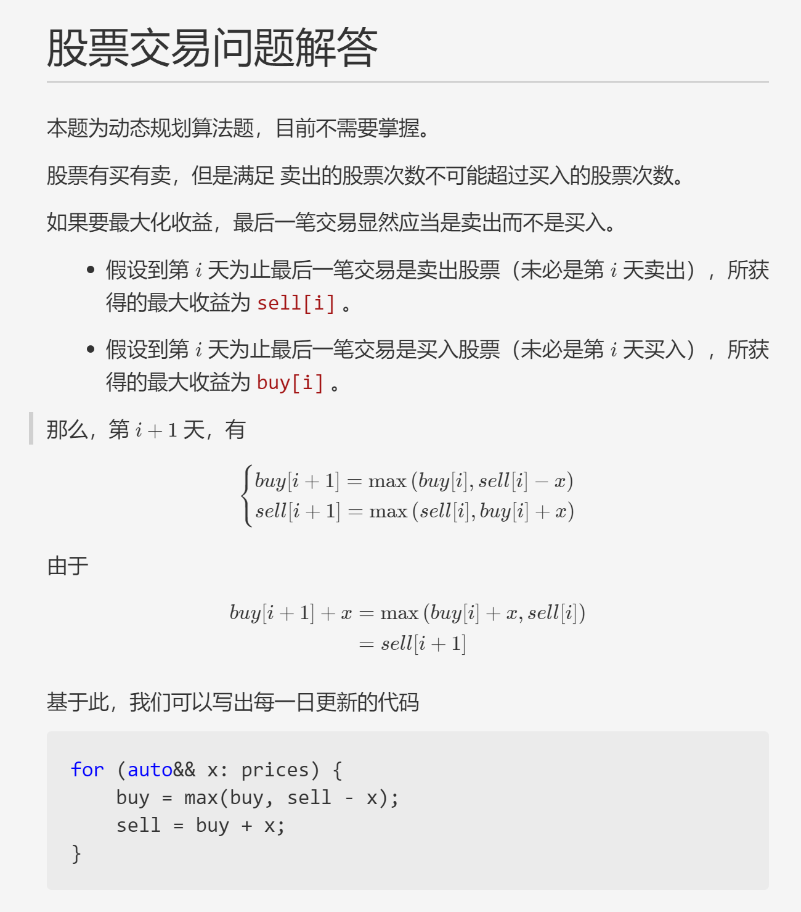

# 股票交易问题解答
## 股票交易多次购买求最大收益

本题为动态规划算法题，目前不需要掌握。

股票有买有卖，但是满足 卖出的股票次数不可能超过买入的股票次数。

如果要最大化收益，最后一笔交易显然应当是卖出而不是买入。

- 假设到第 $i$ 天为止最后一笔交易是卖出股票（未必是第 $i$ 天卖出），所获得的最大收益为 `sell[i]` 。

- 假设到第 $i$ 天为止最后一笔交易是买入股票（未必是第 $i$ 天买入），所获得的最大收益为 `buy[i]` 。

那么，第 $i+1$ 天，有

$$
\begin{cases}
buy[i+1] =  \max \left(buy[i], sell[i] - x\right) \\    
sell[i+1] = \max \left(sell[i], buy[i] + x\right)
\end{cases}
$$


由于 
$$
\begin{aligned}
    buy[i+1] + x &= \max \left(  
    buy[i] + x, sell[i]
    \right) \\
    &= sell[i+1]
\end{aligned}
$$

基于此，我们可以写出每一日更新的代码
```cpp
for (auto&& x: prices) {
    buy = max(buy, sell - x);
    sell = buy + x;
}
```


