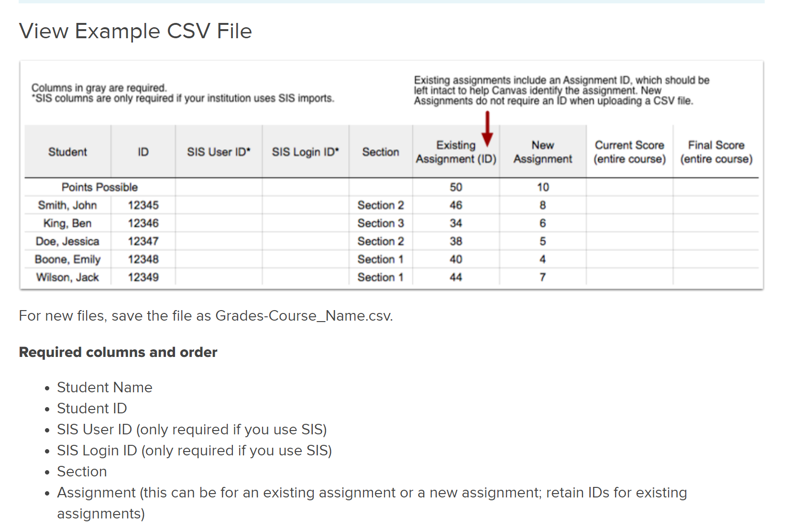
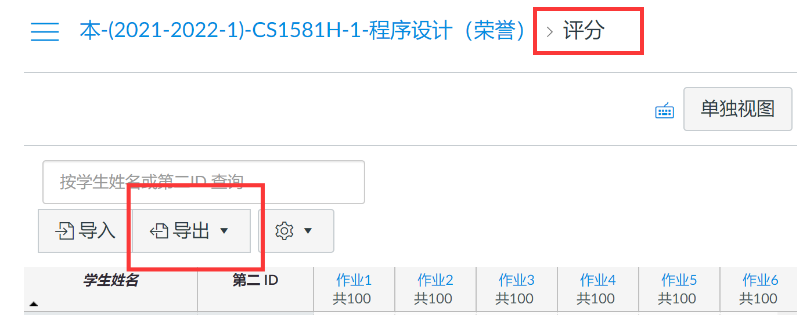
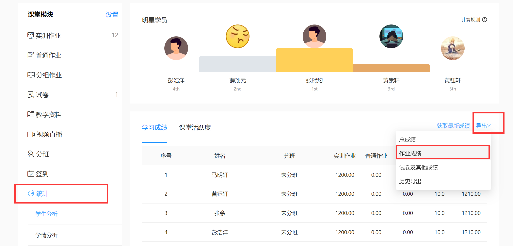
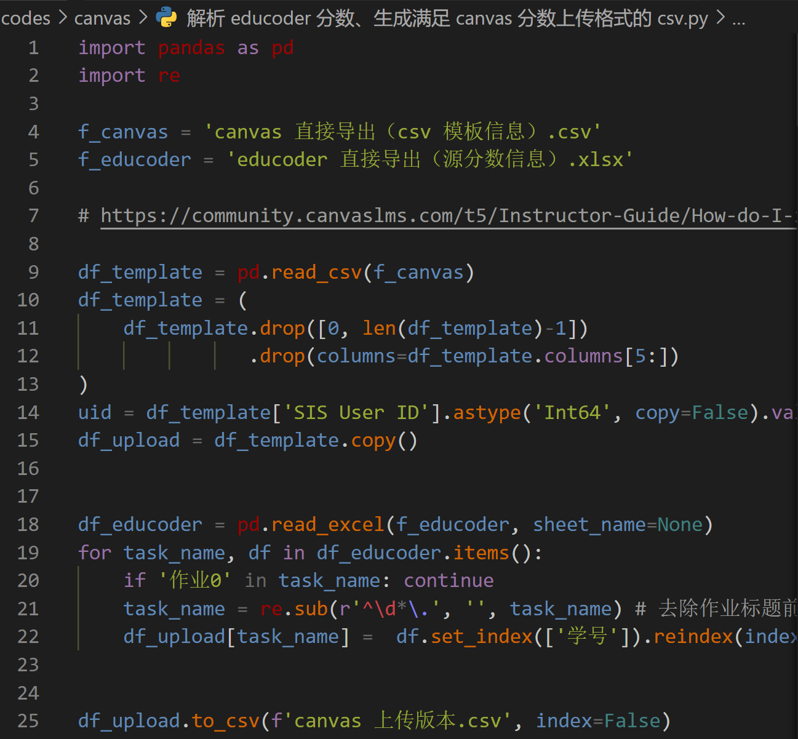

# 助教须知：Canvas 批量上传分数

关于 Canvas 批量上传分数的 `csv` 文件的格式要求见 [canvas 上传格式](https://community.canvaslms.com/t5/Instructor-Guide/How-do-I-import-grades-in-the-Gradebook/ta-p/807) 。

以下是一个相对简洁的流程。

## 首先从 canvas 上导出学生基本信息

## 其次从 educoder 上导出学生全部作业成绩

## 使用脚本转化为符合 [canvas 上传格式](https://community.canvaslms.com/t5/Instructor-Guide/How-do-I-import-grades-in-the-Gradebook/ta-p/807) 的文件即可

脚本源码见 [源码链接](https://gitee.com/OneForward/TACpp/blob/gitee/codes/canvas/%E8%A7%A3%E6%9E%90%20educoder%20%E5%88%86%E6%95%B0%E3%80%81%E7%94%9F%E6%88%90%E6%BB%A1%E8%B6%B3%20canvas%20%E5%88%86%E6%95%B0%E4%B8%8A%E4%BC%A0%E6%A0%BC%E5%BC%8F%E7%9A%84%20csv.py)

修改两个文件名即可。

## 上传到 canvas 

