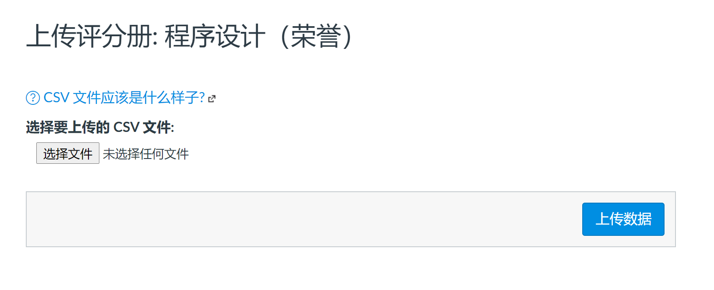

# 助教须知：Canvas 批量上传分数

关于 Canvas 批量上传分数的 `csv` 文件的格式要求见 [canvas 上传格式](https://community.canvaslms.com/t5/Instructor-Guide/How-do-I-import-grades-in-the-Gradebook/ta-p/807) 。

以下是一个相对简洁的流程。

## 首先从 canvas 上导出学生基本信息

## 其次从 educoder 上导出学生全部作业成绩

## 使用脚本转化为符合 [canvas 上传格式](https://community.canvaslms.com/t5/Instructor-Guide/How-do-I-import-grades-in-the-Gradebook/ta-p/807) 的文件即可

脚本源码见 [源码](解析 educoder 分数、生成满足 canvas 分数上传格式的 csv.py)

修改两个文件名即可。

## 上传到 canvas 

