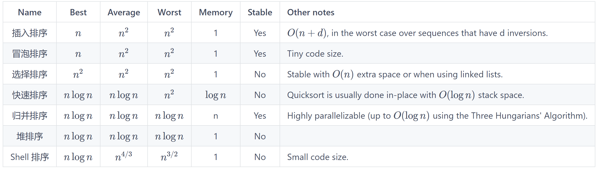

[排序Cpp代码](../codes/sort/sort.cpp)


# 排序笔记

## Notes

- 插入排序、冒泡排序对于几乎排好序的数组的时间复杂度是 $O(n)$
- 插入排序、冒泡排序、归并排序是稳定排序
- 快速排序的最坏复杂度是 $O(n^2)$




|  Name     |    Best    |   Average  |    Worst   |  Memory  | Stable | Other notes                                                                      |   
|:---------:|:----------:|:----------:|:----------:|:--------:|:------:|----------------------------------------------------------------------------------|   
| 插入排序 |    $n$     |    $n^2$   |    $n^2$   |     1    |   Yes  |  $O(n + d)$, in the worst case over sequences that have d inversions.               |   
| 冒泡排序 |    $n$     |    $n^2$   |    $n^2$   |     1    |   Yes  |  Tiny code size.                                                                  |   
| 选择排序 |    $n^2$   |    $n^2$   |    $n^2$   |     1    |   No   |  Stable with $O(n)$ extra space or when using linked lists.    |   
| 快速排序 | $n \log n$ | $n \log n$ |    $n^2$   | $\log n$ |   No   |  Quicksort is usually done in-place with $O(\log n)$ stack space.                 |   
| 归并排序 | $n \log n$ | $n \log n$ | $n \log n$ |     n    |   Yes  |  Highly parallelizable (up to $O(\log n)$ using the Three Hungarians' Algorithm). |   
|  堆排序  | $n \log n$ | $n \log n$ | $n \log n$ |     1    |   No   |                                                                                   |   
| Shell 排序 | $n \log n$ |  $n^{4/3}$ |  $n^{3/2}$ |     1  |   No   |  Small code size.                                                                 |   


## Surprising Sort

```rust
i∈[0, N)                       
    j∈[0, N)
        if A[i] < A[j]: swap(A[i], A[j])
```

## 插入排序

```rust
i∈[1, N)                       //循环N-1遍
    x = A[i]
    j∈[i-1, 0] and A[j] > x    //对于比 x 大的数字全部后移一个单位
        A[j+1] = A[j]
    A[j+1] = x;                 //插入x
```


## 冒泡排序

```rust
 i∈[0, N-1)               //循环N-1遍
   j∈[0, N-1-i)           //每遍循环要处理的无序部分
     swap(j, j+1)          //两两排序（升序/降序）
```


## 选择排序

```rust
i∈[0, N-1)     // 循环N-1遍
    min = i
    j∈[i+1, N) // 找到后续的最小值
        if A[j] < A[min]: min = j 
    swap(A[i], A[min])
```


## Shell 排序

```rust
gaps = [701, 301, 132, 57, 23, 10, 4, 1]

for gap in gaps
    for i∈[gap, N)                       //循环N-1遍
        x = A[i]
        j∈[i-gap, -gap, 0] and A[j] > x    //对于比 x 大的数字全部后移一个单位
            A[j+gap] = A[j]
        A[j+gap] = x;                 //插入x
```
 


# 外排序 


> 设在磁盘上存放有375000个记录，做5路平衡归并排序，内存工作区能容纳600个记录，为把所有记录排好序，需要做( ) 趟归并排序。

```
大概可以这么理解

假设磁盘有375KB ，内存为 600B

0. 每次加载 600B 进入内存，使用任何内排序的方法排序（快排等），可以切分外磁盘为  625 x 600B sorted  chunks
1. the 1st merge pass: combining 5 x 600B chunks at a time, resulting 125 x 3KB sorted chunks
2. the 2nd merge pass: combining 5 x 3 KB chunks at a time, resulting 25 x 15KB sorted chunks
3. the 3rd merge pass: combining 5 x 15KB chunks at a time, resulting 5 x 75KB sorted chunks
4. the 4th merge pass: combining 5 x 75KB chunks at a time, resulting 1 x 375KB sorted result
```