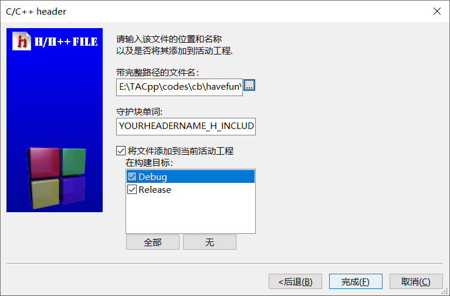

# [CodeBlocks 相关问题汇总](https://github.com/OneForward/TACpp/blob/master/tutorials/CodeBlocks.md)

> 遇到了任何问题都不要慌张，
> 1. 上机的时候向助教询问
> 2. QQ群里主动提问或者私聊助教询问
> 3. 微信群里询问
> 4. 百度搜索你遇到的问题

本教程提供 CodeBlocks 【以版本20.03(Windows)为例】 的安装、汉化、使用以及其他问题的指导。

- [CodeBlocks 相关问题汇总](#codeblocks-相关问题汇总)
  - [下载 `codeblocks-20.03mingw-setup.exe`](#下载-codeblocks-2003mingw-setupexe)
  - [安装](#安装)
  - [第一次使用](#第一次使用)
    - [文件关联 CodeBlocks 的提示](#文件关联-codeblocks-的提示)
    - [新建一个C++项目](#新建一个c项目)
  - [CodeBlocks 如何进行简单的代码调试 / Debug ?](#codeblocks-如何进行简单的代码调试--debug-)
  - [汉化](#汉化)
    - [汉化包链接](#汉化包链接)
    - [解压汉化包](#解压汉化包)
    - [配置CodeBlocks](#配置codeblocks)
  - [Q & A](#q--a)
    - [1. 如何解决中文乱码问题](#1-如何解决中文乱码问题)
    - [2. 如何修改编译器类型](#2-如何修改编译器类型)
    - [3. 如何设置编译器路径](#3-如何设置编译器路径)
    - [4. 如何开启 C++11 或者更新的 C++ 标准](#4-如何开启-c11-或者更新的-c-标准)
    - [5. 首页跳出的 `Tip of the Day` 是什么](#5-首页跳出的-tip-of-the-day-是什么)
    - [6. 如何设置 Debug / 调试器 路径](#6-如何设置-debug--调试器-路径)
    - [7. 侧边栏消失了怎么办？](#7-侧边栏消失了怎么办)
    - [8. 编译输出栏消失了怎么办？或者我的xxx布局消失了找不到了怎么办？](#8-编译输出栏消失了怎么办或者我的xxx布局消失了找不到了怎么办)
    - [9. CodeBlocks 如何添加多文件到项目中？](#9-codeblocks-如何添加多文件到项目中)
    - [10. 小心存错文件类型 （误存储为 C 文件类型，导致编译失败）](#10-小心存错文件类型-误存储为-c-文件类型导致编译失败)


## 下载 `codeblocks-20.03mingw-setup.exe` 

- [交大云盘下载链接](https://jbox.sjtu.edu.cn/l/71KbdW)
- 或者向助教索取。


## 安装


<details>
  <summary> 安装【点开小三角形查看】 </summary>

1. 双击安装包 `codeblocks-20.03mingw-setup.exe` 

2. 点击 `Next`, `I Agree`, `Next`, `Install`
   


之后等待安装即可。


安装完成后后提示是否马上运行，这里可以直接运行，也可以不马上运行。


点击 `Next`, `Finish` 安装就结束啦。


往后正常使用时，我们可以通过点击桌面的 CodeBlock 快捷键运行。如果启动遇到了问题，可以向助教询问。

</details>

## 第一次使用

### 文件关联 CodeBlocks 的提示


<details>
  <summary> 文件关联 CodeBlocks 的提示【点开小三角形查看】 </summary>

  第一次使用可能会出现是否要进行 C++/C 源文件关联 CodeBlocks 的提示, 


建议初学者选择 **最后一项**，全部关联。对其他IDE更熟悉的同学则可以根据自己的需求选择。


</details>


### 新建一个C++项目


<details>
  <summary> 新建一个C++项目【点开小三角形查看】 </summary>

现在，我们来新建一个 C++ 命令行项目，

1. 选择开始页面正中央的 `Create a new project`


2. 选择 `Console application`, 然后点击 `Go`。我们要建立的是一个命令行项目。本学期的上机作业绝大部分都是命令行作业。


3. 选择 `Skip Next Time` 点击 `Next`。之后我们便可以跳过这一步。


4. 选择 `C++` 项目，点击 `Next`


5. 设置项目的标题与保存位置。

项目标题自拟，保存路径也可以任意。

> 但是**建议标题与文件夹路径中都不含有中文和空格。**

建议设置一个专门的文件夹来存放所有的C++项目。

以下是一个例子，我选择了一个全英文的名称作为项目标题，我保存在一个没有空格和中文名称的路径中。


6. 项目设置完成了。点击 `Finish` 即可。


7. 在刚刚建好的项目下，点击 Sources 左侧的 + 号，然后双击 main.cpp 就可以看到待编辑的源代码啦。


8. 选择这里的带有绿色三角形的小齿轮，含义是 Build and Run，也就是编译和运行，然后我们就可以看到黑色的命令行输出啦。大功告成。


> 以后我们每一次作业，都可以按照上述 1-8 的步骤进行。步骤3 选择了 Skip 之后以后可以跳过。新建项目遇到了任何问题都请及时向助教询问。


</details>


## CodeBlocks 如何进行简单的代码调试 / Debug ?

<details>
  <summary> CodeBlocks 如何进行简单的代码调试 / Debug【点开小三角形查看】 </summary>

Debug 的功能：

1. 提供运行时的中断处的局部变量和全局变量值
2. 在运行时，观察中断处指定表达式的值

这一节适合同学们在对编写C++代码较为熟悉之后学习。

对于如下一段简单的代码，我们提供一份简单的代码调试指导。

```cpp
#include <iostream>

using namespace std;

int sumCubic(int n) {
    // 计算 1^3 + 2^3 + ... + n^3
    int sum = 0;
    while (n) {
        sum += n * n * n;
        n--;
    }
    return sum;
}

int main()
{
    for (int n = 0; n <= 10; ++n) {
        cout << "sumCubic(" << n << ") = " << sumCubic(n) << endl;
    }

    return 0;
}
```

将代码拷贝到你的项目里面（你可以新建一个项目，然后替换掉 main.cpp 里面的内容）

然后如图，鼠标单击行号即可设置中断点，打开**红色小三角形**开启调试。


如图，你会看到一个黄标运行到断点处。如图找到 蜘蛛形状的 Debugging Windows 选项，开启 `Watches`，然后便可以看到函数的局部变量的值了。


你也可以输入表达式，观察断点处表达式的值。


最后，可以点击红色的 X 退出 Debug。


</details>


## 汉化

### 汉化包链接

汉化包请点击 [交大云盘](https://jbox.sjtu.edu.cn/l/Ou6oNv) 下载

汉化包是一个名为 `locale.zip` 的压缩包

### 解压汉化包

<details>
  <summary> 解压汉化包【点开小三角形查看】 </summary>

首先找到你们的 `CodeBlocks` 的安装位置，点进 `share` 文件夹


然后点进 `CodeBlocks` 文件夹


在当前这个文件夹下解压汉化包


最终的汉化文件的位置应该如图所示，即 `locale\zh_CN\zh_CN.mo`


</details>

### 配置CodeBlocks

<details>
  <summary> 配置CodeBlocks【点开小三角形查看】 </summary>

* 打开 CodeBlocks, 点击 Settings->Environment


* 点击 View

* 勾选 Internationalization

* 右侧下拉选择 Chinese(Simplified)

* 点击 OK 即可


* 重启 CodeBlocks 即可看到汉化效果


</details>


## Q & A

### 1. 如何解决中文乱码问题

建议阅读孟老师提供的文档。[交大云盘链接](https://jbox.sjtu.edu.cn/l/toTO8T)

或者按照如下步骤进行修改，如果仍然失败请咨询助教。

#### 设置文件编码格式、编译命令中增加执行编码参数

<details>
  <summary> 设置文件编码格式、编译命令中增加执行编码参数【点开小三角形查看】 </summary>

* 设置 -> 编辑器 (Settings -> Editor) 


* 设置文件格式默认为 UTF-8


* 设置 -> 编译器 (Settings -> Compiler)


* 在 `全局编译器设置` 下，`编译器设置 ` 选择 `其他编译器设置`，然后在图示位置添加如下文本

```
-fexec-charset=gbk
```


</details>


### 2. 如何修改编译器类型

<details>

  <summary> 如何修改编译器类型【点开小三角形查看】  </summary>

* Settings-›Compiler


* 在 `global compiler settings`下，`Selected Compiler`选择 `GNU GCC Compiler`，然后点击 `Set as default`


</details>

### 3. 如何设置编译器路径

<details>

  <summary> 如何设置编译器路径【点开小三角形查看】  </summary>

* Settings-›Compiler


* 在 `global compiler settings`下，`executable toolchain` 下设置你的编译器的安装目录
  


</details>

### 4. 如何开启 C++11 或者更新的 C++ 标准 

<details>

  <summary> 如何开启 C++11 或者更新的 C++ 标准【点开小三角形查看】  </summary>

* Settings-›Compiler


* 在 `全局编译器设置` 下，`编译器标志` 下 在 `常规` 下，勾选 C++11 到 C++20 之间任何一个都可以。
  


</details>

### 5. 首页跳出的 `Tip of the Day` 是什么

每日小贴士，不用管。如果以后不想看到请去掉底下勾选。

### 6. 如何设置 Debug / 调试器 路径

<details>

  <summary> 如何设置 Debug / 调试器 路径【点开小三角形查看】  </summary>


* Settings->Debugger


* 在 `GDB/CDB debugger` 下， 点击 `Default` ， 然后设置你的 `gdb.exe` 的路径，调试器类型选择 `gdb` 。


</details>

### 7. 侧边栏消失了怎么办？

<details>

  <summary> 侧边栏消失了怎么办？【点开小三角形查看】  </summary>

* 视图 -> 管理器, 点击勾选


</details>

### 8. 编译输出栏消失了怎么办？或者我的xxx布局消失了找不到了怎么办？

<details>

  <summary> 编译输出栏消失了怎么办？或者我的xxx布局消失了找不到了怎么办？【点开小三角形查看】  </summary>

* 视图->界面外观->删除当前，即可重置你的视图


</details>


### 9. CodeBlocks 如何添加多文件到项目中？

<details>

  <summary> CodeBlocks 如何添加多文件到项目中？【点开小三角形查看】  </summary>


- 设置头文件名


- 点击完成即可




</details>


### 10. 小心存错文件类型 （误存储为 C 文件类型，导致编译失败）

<details>

  <summary> 小心存错文件类型 （误存储为 C 文件类型，导致编译失败）【点开小三角形查看】  </summary>

譬如如下文件编译时会提示找不到 `iostream`，这是因为误存储为 C 文件类型了，而 C 里面 没有 `iostream` 这个头文件库。


其实注意到在为 Project 添加文件的过程中，有一个如下的选择文件类型的过程


</details>