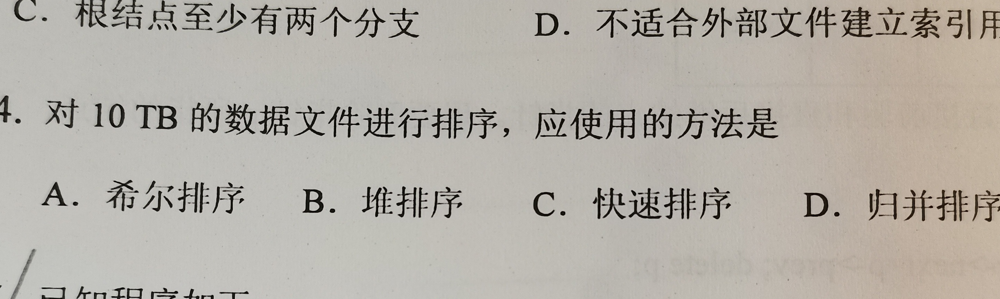
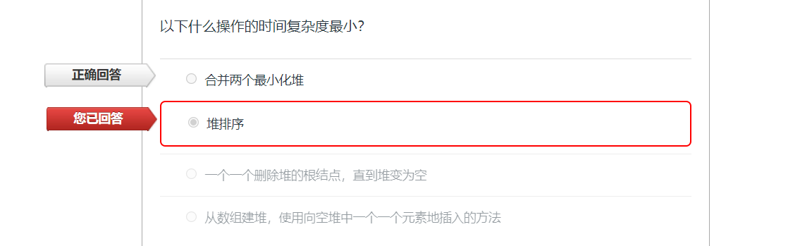

# 数据结构习题



```
解答： 选D. 
10TB装载不进内存，使用外排序，归并排序 
```


```
解答：选D
已知AVL树中序遍历是降序序列，说明这棵AVL树是左大右小
因此
- 最大元素在最左下角，没有左子树，但可能有右子树，因此不一定是叶子节点；
- 同理最小元素未必是叶子
- 如果只有两个数，根节点的度为1
- 最后插入的节点可能是叶子也可能不是
```


```
解答：选D. 理由同上
```


```
解答：

对于二叉搜索树，中序遍历的结果是从小到大的序列

本题的 Solution 里的递归函数本质是中序遍历，每次访问自己 K--， 因此这里是求 第 K 小的数字。
```



```
解答：

- 合并两个最小堆的复杂度就是造堆的复杂度，O(M+N)
- 堆排序复杂度是 O(N log N)
- 逐个出堆的过程，直到变空，复杂度 O(N log N)
- 逐个入堆，复杂度 O(N log N)

```


```
解答：选 C
删除头元素 -> 利用尾指针删除下一元素即可
插入最后 -> 利用尾指针插入即可
```


```
解答：选 C

从根节点到新节点的插入位置有唯一一条路径，因此只影响这条路径上至多 O(h) 个节点的高度。
```


```
解答：
队列初始为空

第一个元素有1种可能位置

插入第一个元素之后，
第二元素有2种可能位置

插入第二个元素后
第三个元素也有2种可能位置

依次类推。因此共有 8 种序列
```


```
解答：任何树都可以使用二叉树来描述，也就是兄弟链表树，右节点代表兄弟，子节点代表第一个孩子

根节点没有兄弟，因此右节点是空
```


```
解答：快排每一趟都保证，pivot 左边的数都比它小，右边的数都比它大

对于 C， 第一个 pivot 只能是 9 （左边的数都比它小，右边没有数）
但除去这个数后找不到第二个 pivot 了
```


## 排序

[排序伪代码](../codes/sort/sort.md)

[排序Cpp代码](../codes/sort/sort.cpp)

> 设在磁盘上存放有375000个记录，做5路平衡归并排序，内存工作区能容纳600个记录，为把所有记录排好序，需要做( ) 趟归并排序。

```
大概可以这么理解

假设磁盘有375KB ，内存为 600B

0. 每次加载 600B 进入内存，使用任何内排序的方法排序（快排等），可以切分外磁盘为  625 x 600B sorted  chunks
1. the 1st merge pass: combining 5 x 600B chunks at a time, resulting 125 x 3KB sorted chunks
2. the 2nd merge pass: combining 5 x 3 KB chunks at a time, resulting 25 x 15KB sorted chunks
3. the 3rd merge pass: combining 5 x 15KB chunks at a time, resulting 5 x 75KB sorted chunks
4. the 4th merge pass: combining 5 x 75KB chunks at a time, resulting 1 x 375KB sorted result
```

> 问题： 若序列的原始状态为 {1，2，3，4，5，10，6，7，8，9}，要想使得排序过程中元素比较次数最少，则应该采用（）方法
- 插入排序
- 选择排序
- 希尔排序
- 冒泡排序

```
解答：插入排序。
对于近似排序好的数组使用插入排序或者（带有 flag 优化的）冒泡排序可以在 O(N) 时间排好序。命题人可能认为这里的冒泡排序的选项是指最早版本的不带优化的版本。
```

---

> 问题：如果只想得到1000个元素组成的序列中第10个最小元素之前的部分排序的序列，用（）方法最快
* 冒泡排序
* 快速排序
* 希尔排序
* 堆排序

```
解答：堆排序。
使用一个规模为10的最大堆，不断向里面插入数组元素；如果堆的规模超过10，就 pop 根节点（最大元素），最后堆里面就是最小的10个元素；最后依次 pop 堆的根节点，倒序即为排好序的 10 个元素。复杂度约为 1000 * log(10) ≈ 4000。

冒泡排序比较次数约为 1000 * 10。

快速排序和希尔排序都需要完全排序。
```

```
Notes: 另一种方法是使用 O(N) 的快速选择，可以挑出最小的10个元素（未排序）；然后对 10 个元素做排序。复杂度约为 1000 + 10 * log(10) ≈ 1040;

本题题目有点不符合实际。
```

---
> 问题：下列排序算法中，（）排序在一趟结束后不一定能选出一个元素放在其最终位置上
* 选择
* 冒泡
* 归并
* 堆

```
解答：归并排序的一趟是指 一次 merge(A, B) 的过程，其中 A 和 B 都是原数组中已经排序好的两个子数组，将其合并为一个较大的排序好的数组。
```

## 优先级队列

> 给定一个100万元素的基于数组的最大堆，查找堆中最小元素，需要的计算规模大约是多少？ (设log(10)=3.32)
* 100万
* 2000万
* 25万
* 20

```
解答：计算规模应该是50万。
最小元素一定在叶子部分（堆是完全二叉树，也就是完全二叉树的最深的部分），恰好是数组的后一半部分。
本题没有合适的选项。
```

## 哈希表

> 问题：一个规模为11的哈希表，采用哈希函数Hash(key) = key mod 11，用哈希表外的线性表存放冲突结点，向其依次插入17，12，24，60，29，38，35，46，查找46需要____次查找
* 1
* 3
* 8
* 11

```
解答： 

Open Hashing (Separate Chaining):

In open hashing, keys are stored in linked lists attached to cells of a hash table.

Closed Hashing (Open Addressing):

In closed hashing, all keys are stored in the hash table itself without the use of linked lists.

本题为 Closed Hashing Table。建表过程如下

17 -> 6, 12 -> 1, 24 -> 2, 60 -> 5, 29 -> 7, 38 -> 5 -> 6 -> 7 -> 8,  
35 -> 3, 46 -> 2 -> 3 -> 4

因此查找 46 需要 3 次查找。
```