# Qt实践-2048游戏

本教程将使用Qt的GUI组件写一个简单的2048游戏，希望能帮助同学们初步感受一下Qt绘制界面的编程特点，最终效果如下

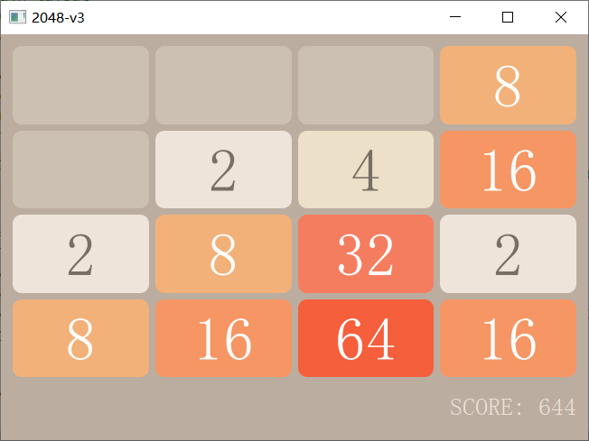

## 新建Qt项目

<details>
  <summary> 新建Qt项目的具体步骤 </summary>

按住 `Crtl Shift N` 新建工程项目。

* 点击确定。

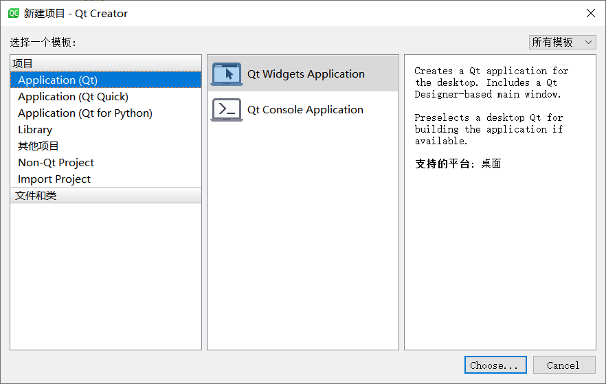

* 设置工程名。

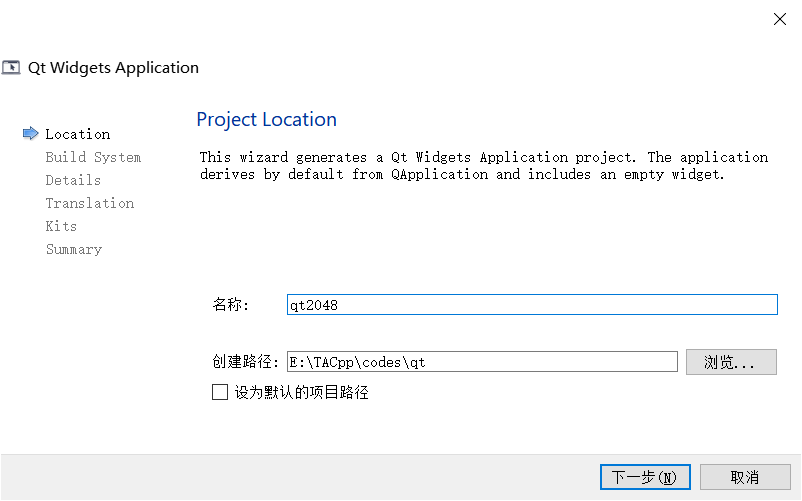

* 一路点击默认选项。除了此处，不勾选 ui form。

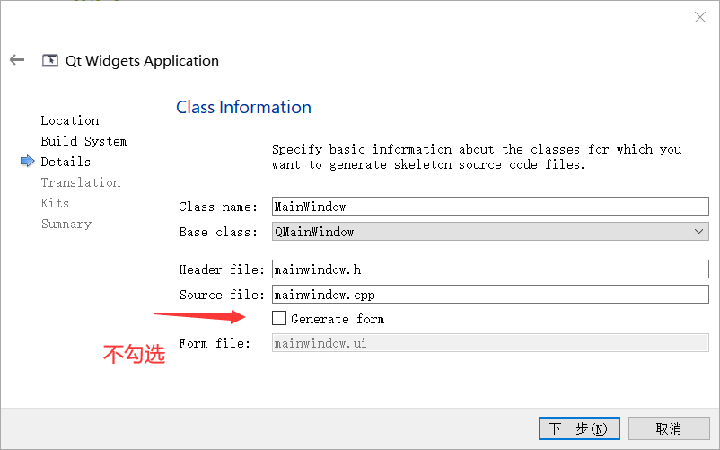

最终我们会得到如图所示的一个项目

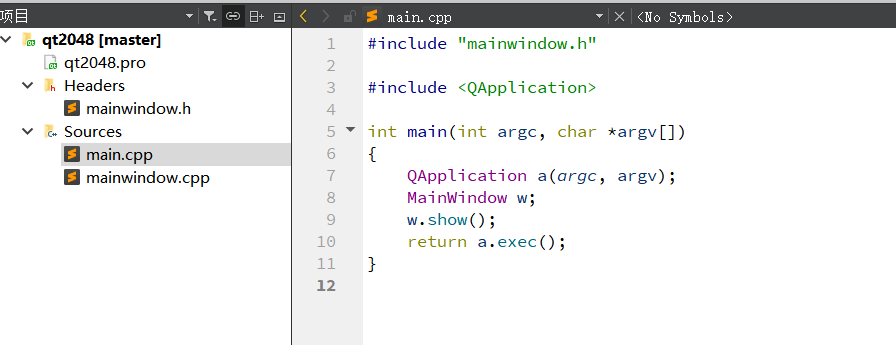

按住 `Ctrl R` 运行可以得到一个没有任何组件的界面程序。

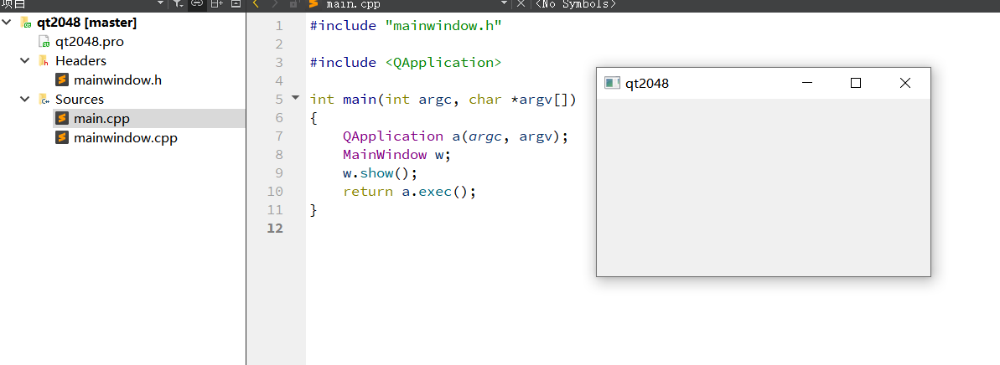


</details>

## Qt实践-2048游戏教程(1): GameBoard 模块
首先我们绘制 2048 游戏的主界面，来添加一个 GameBoard 模块。

<details>
  <summary> 在项目中添加一个 GameBoard 模块  </summary>

* 右键项目名称，点击 `Add New` 添加一个新的类。

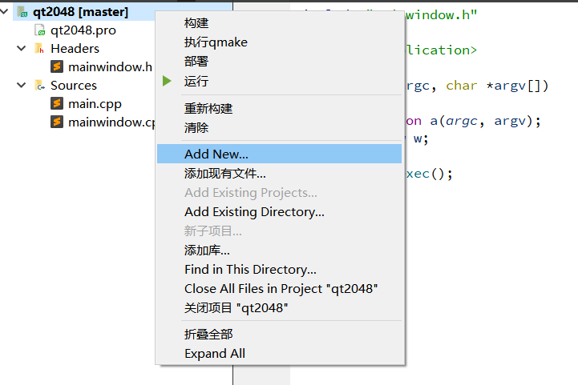

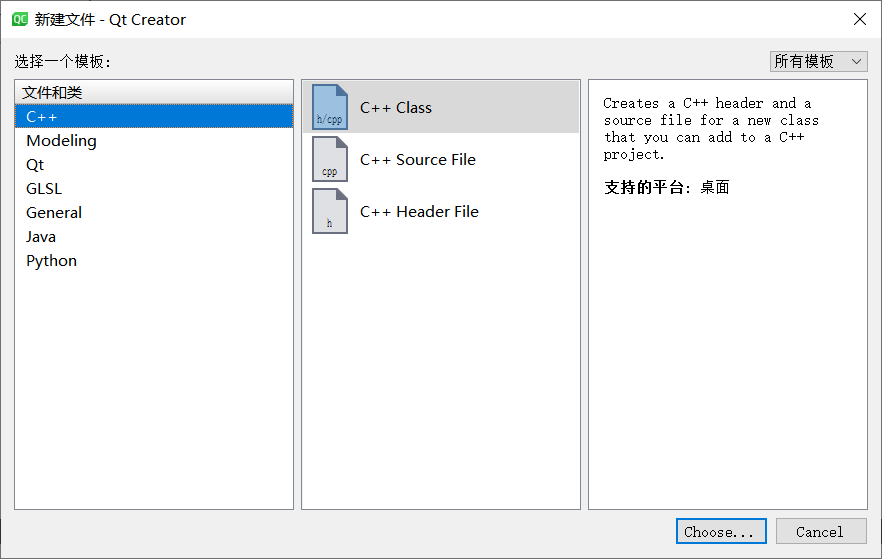

* 我们希望 GameBoard 是一个 QWidget 组件，用于盛放游戏主界面的其他小组件。配置如下

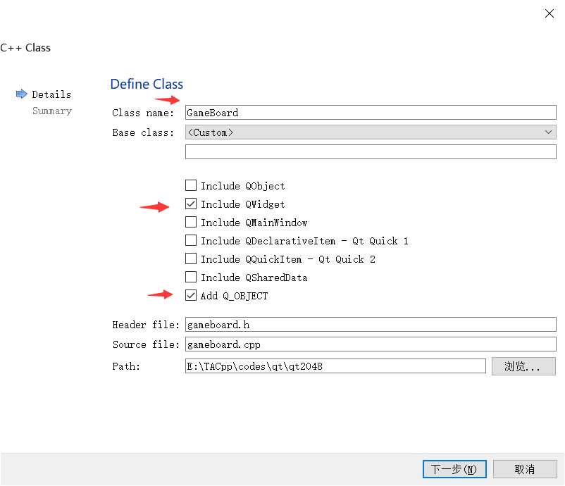

* 完成后，我们的项目会增加 gameboard.h 和 gameboard.cpp 两个文件。

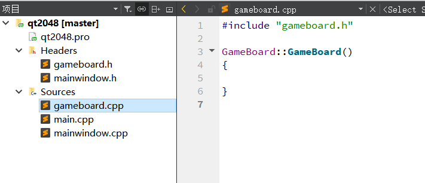
</details>


接下来我们添加绘制主界面代码（点开小三角形可以查看代码）。


<details>
  <summary> gameboard.h  </summary>

```cpp
// gameboard.h 
#ifndef GAMEBOARD_H
#define GAMEBOARD_H

#include <QLabel>
#include <QVBoxLayout>
#include <QGridLayout>

class GameBoard : public QWidget
{
    Q_OBJECT
public:
    explicit GameBoard(QWidget *parent = 0);

private:

    // main layout
    QVBoxLayout *mainLayout;
    // grid layout of board
    QGridLayout *boardLayout;
    // score widget
    QLabel *score;

};

#endif // GAMEBOARD_H
```

</details>

<details>
  <summary> gameboard.cpp  </summary>

```cpp
// gameboard.cpp 
#include "gameboard.h"

GameBoard::GameBoard(QWidget *parent) :
    QWidget(parent)
{
    // set default size
    resize(650,450);

    // create the main layout
    mainLayout = new QVBoxLayout();
    setLayout(mainLayout);

    // create the board layout
    boardLayout = new QGridLayout();

    auto cell = new QLabel();
    cell->setText("2");
    cell->setAlignment(Qt::AlignCenter);
    cell->setStyleSheet("QLabel { background: rgb(238,228,218); color: rgb(119,110,101); font: bold; border-radius: 10px; font: 40pt; }");
    boardLayout->addWidget(cell);

    mainLayout->insertLayout(0, boardLayout);

    // create the score widget and add it to the board
    score = new QLabel(QString("SCORE: %1").arg(0));
    score->setStyleSheet("QLabel { color: rgb(235,224,214); font: 16pt; }");
    score->setFixedHeight(50);
    mainLayout->insertWidget(1, score, 0, Qt::AlignRight);

    // style sheet of the board
    setStyleSheet("GameBoard { background-color: rgb(187,173,160) }");
}
```

</details>

<details>
  <summary> main.cpp </summary>

```cpp
// main.cpp
#include <QApplication>
#include "gameboard.h"

int main(int argc, char *argv[])
{
    QApplication app(argc, argv);

    GameBoard board;
    board.show();

    return app.exec();
}
```

</details>


将代码复制粘贴进去后，按住 `Ctrl R` 编译运行，我们得到预期效果如下

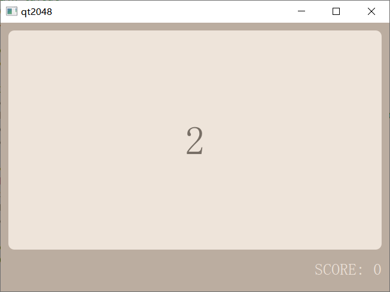

接下来我们将逐行解释这些代码的含义。

### 知识点

### `Q_OBJECT` 宏

`Q_OBJECT` 宏用于提供 Qt 中的信号量和槽机制(Signals and Slots)。暂时可以不必深究细节。


### QWidgets 

**Widget** 是Qt中创建用户界面的主要元素，它可以显示数据和状态信息，接收用户输入，并为其他应该组合在一起的 Widget 提供一个容器（可以堆叠盛放其他的 Widgets ）。最外层的 Widget 称为 Window。

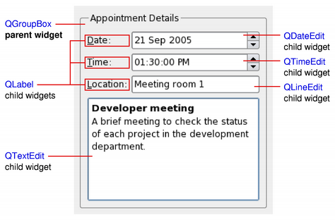


有哪些常见的 Widget 呢， [widget-classes](https://doc.qt.io/qt-5/widget-classes.html#basic-widget-classes) 展示了大量的 Qt 原生的 Widget。

我们的游戏界面主体就是从 QWidget 继承起来的一个组件。

```cpp
class GameBoard : public QWidget {...}
```

### QLayout 

* QHBoxLayout 将 Widget 按水平行排列，从左到右。

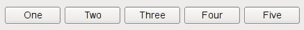

* QVBoxLayout 将 Widget 按垂直排列，从上到下。

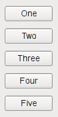

* QGridLayout 在二维网格中布局 Widget。Widget 可以占用多个单元格。

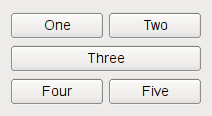

### QLabel

QWidgets 的组件之一。QLabel 用于显示文本或图像。

### Qt 样式表 `setStyleSheet`

大部分 QWidgets 都支持丰富的 样式表设置。

如下代码
```cpp
    auto cell = new QLabel();
    cell->setText("2");
    cell->setAlignment(Qt::AlignCenter);
    cell->setStyleSheet("QLabel { background: rgb(238,228,218); color: rgb(119,110,101); font: bold; border-radius: 10px; font: 40pt; }");
```

* `setText` 设置显示的文本。此处为 `"2"`
* `setAlignment` 设置对齐模式。此处为中心对齐 `Qt::AlignCenter`
* `setStyleSheet` 使用样式表。此处使用的是如下的样式配置
    ```css
    QLabel { 
        background: rgb(238,228,218); 
        color: rgb(119,110,101); 
        font: bold, 40pt; 
        border-radius: 10px; 
    }
    ```

    * 含义是设置 QLabel 的 背景 颜色是 rgb(238,228,218) 
  <div id="rectangle" style="width:20px; height:20px; background-color:rgb(238,228,218)"></div>

    * 内容颜色是 rgb(119,110,101) 
  <div id="rectangle" style="width:20px; height:20px; background-color:rgb(119,110,101)"></div>

    * 字体是 粗体, 大小 40pt

    * 边框为圆角, 圆角半径是 10px


样式效果如下

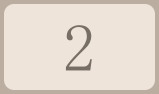

### GameBoard 布局的阐释

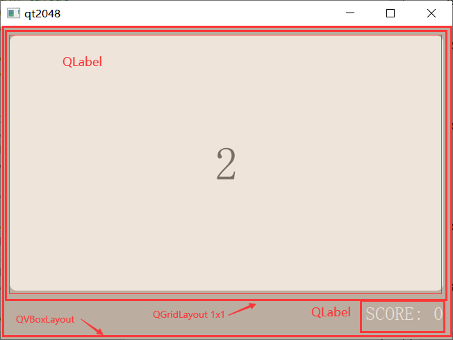

我们来阅读源代码。将布局的部分抽取出来如下

```cpp
    // create the main layout
    mainLayout = new QVBoxLayout();
    setLayout(mainLayout);

    // create the board layout
    boardLayout = new QGridLayout();

    auto cell = new QLabel("2");
    boardLayout->addWidget(cell);

    mainLayout->insertLayout(0, boardLayout);

    // create the score widget and add it to the board
    score = new QLabel("SCORE: 0");
    mainLayout->insertWidget(1, score, 0, Qt::AlignRight);
```

可以理解主要做了这么几件工作

1. 构造一个 `QVBoxLayout`, 命名为 `mainLayout`, 它将界面设置成竖直方向的排布模式。

2. 构造一个 `QGridLayout`, 命名为 `boardLayout`, 它将用于配置方块的排布模式是网格状排布。我们将把它插入在 `mainLayout` 的上端。

3. 构造一个 `QLabel`, 命名为 `cell`, 这是一个小方块。我们设置它显示的文本是 `"2"`, 插入在 boardLayout 中。

4. 构造一个 `QLabel`, 命名为 `score`, 这是一个显示分数的组件。我们设置它显示的文本是 `"SCORE: 0"` , 插入在 `QGridLayout` 的下端，且靠右对齐。


### 4x4 的游戏面板

写个循环将其中的 QGridLayout 用 4x4 的小方块填充 

```cpp
    for (int i = 0; i < 4; ++i) {
        for (int j = 0; j < 4; ++j) {
            auto cell = new QLabel();
            cell->setText("2");
            cell->setAlignment(Qt::AlignCenter);
            cell->setStyleSheet("QLabel { background: rgb(238,228,218); color: rgb(119,110,101); font: bold; border-radius: 10px; font: 40pt; }");
            boardLayout->addWidget(cell, i, j);
        }
    }
```

我们有如下效果

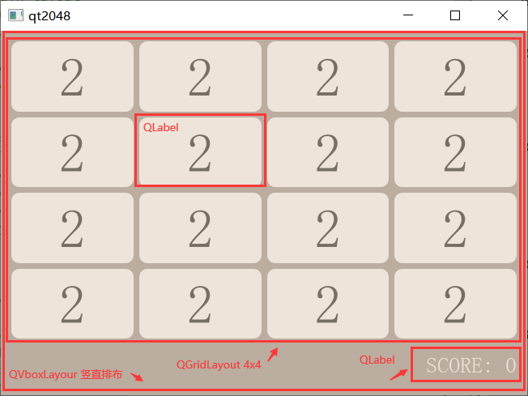

好了，到此为止，游戏主界面就画好了。下一步，我们重点关注每一个小方块 Cell 。我们知道2048游戏的小方块可以是数字 {2, 4, 8, 16, 32, 64, 128, 256, 512, 1024, 2048} ， 我们希望为每一个数字呈现不同的颜色，因此需要设计一组样式表列表。

---


<details>
  <summary> 附：删去不需要的 mainwindow 模块 </summary>

由于我们的代码不需要 mainwindow 模块，我们可以删去 mainwindow.h 和 mainwindow.cpp 两个文件。右键文件名选择 `Remove` 即可。

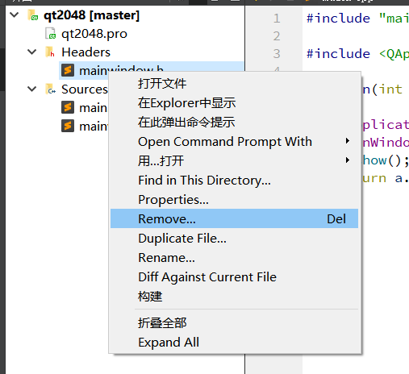

</details>


