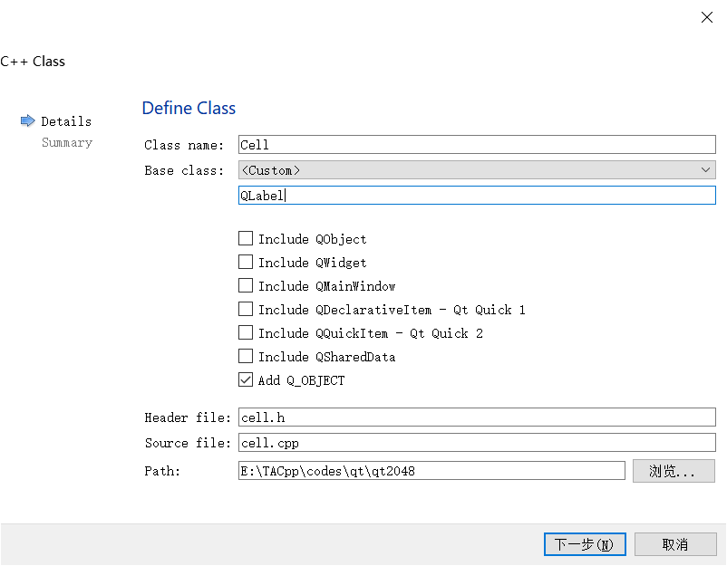
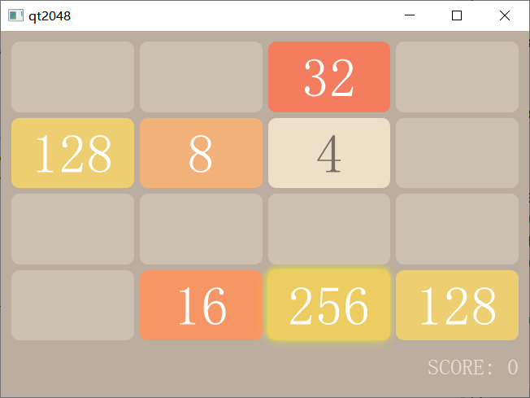

# Qt实践-2048游戏教程(2): Cell 模块

* [Qt实践-2048游戏教程(1): GameBoard 模块](https://github.com/OneForward/TACpp/blob/master/tutorials/qt-2048-v1.md)
* [Qt实践-2048游戏教程(2): Cell 模块](https://github.com/OneForward/TACpp/blob/master/tutorials/qt-2048-v2.md)
* [Qt实践-2048游戏教程(3): Game 模块](https://github.com/OneForward/TACpp/blob/master/tutorials/qt-2048-v3.md)

上一步，游戏主界面布局已经画好了。下一步，我们重点关注每一个小方块 Cell 。我们知道2048游戏的小方块可以是数字 {2, 4, 8, 16, 32, 64, 128, 256, 512, 1024, 2048} ， 我们希望为每一个数字呈现不同的颜色，因此需要设计一组样式表列表。

## 添加 `Cell` 模块

仿照添加 `GameBoard` 模块的方法，我们添加一个用于绘制小方块的 `Cell` 模块。

根据上一步教程中提到的，我们的 `Cell` 应当是一个 `QLabel` 组件。配置如下



然后我们复制粘贴如下代码（点开小三角形可以查看代码）。


<details>
  <summary> cell.h   </summary>
  
```cpp
// cell.h
#ifndef CELL_H
#define CELL_H

#include <QLabel>

class Cell : public QLabel
{
    Q_OBJECT
public:
    Cell(int value);

    void draw();
private:

    int value;
};

#endif // CELL_H
```
</details>

头文件中声明了一个 `Cell` 类。 `Cell` 继承自 `QLabel` ，可以展示文字，同时可以设置样式。 `Cell` 带有

* 一个成员 `value` ，用于表示小方块的值；
* 一个 `draw() `成员函数，可以设置小方块将要呈现的样式。


<details>
  <summary> cell.cpp </summary>
  
```cpp
// cell.cpp
#include <QGraphicsDropShadowEffect>
#include "cell.h"

Cell::Cell(int v): value(v)
{
    setAlignment(Qt::AlignCenter);
}

void Cell::draw()
{
    setText(QString::number(value));
    auto style = QString("Cell { background: %1; color: %2; font: bold; border-radius: 10px; font: 40pt; }");
    switch (value) {
    case 2: {
        setStyleSheet(style.arg("rgb(238,228,218)").arg("rgb(119,110,101)"));
        break;
    }
    case 4: {
        setStyleSheet(style.arg("rgb(237,224,200)").arg("rgb(119,110,101)"));
        break;
    }
    case 8: {
        setStyleSheet(style.arg("rgb(242,177,121)").arg("rgb(255,255,255)"));
        break;
    }
    case 16: {
        setStyleSheet(style.arg("rgb(245,150,100)").arg("rgb(255,255,255)"));
        break;
    }
    case 32: {
        setStyleSheet(style.arg("rgb(245,125,95)").arg("rgb(255,255,255)"));
        break;
    }
    case 64: {
        setStyleSheet(style.arg("rgb(245,95,60)").arg("rgb(255,255,255)"));
        break;
    }
    case 128: {
        setStyleSheet(style.arg("rgb(237,207,114)").arg("rgb(255,255,255)"));
        break;
    }
    case 256: {
        QGraphicsDropShadowEffect *dse = new QGraphicsDropShadowEffect();
        dse->setColor(Qt::yellow);
        dse->setBlurRadius(20);
        dse->setOffset(-1);
        setGraphicsEffect(dse);
        setStyleSheet(style.arg("rgb(237,204,97)").arg("rgb(255,255,255)"));
        break;
    }
    case 512: {
        QGraphicsDropShadowEffect *dse = new QGraphicsDropShadowEffect();
        dse->setColor(Qt::yellow);
        dse->setBlurRadius(30);
        dse->setOffset(-1);
        setGraphicsEffect(dse);
        setStyleSheet(style.arg("rgb(237,204,97)").arg("rgb(255,255,255)"));
        break;
    }
    case 1024: {
        QGraphicsDropShadowEffect *dse = new QGraphicsDropShadowEffect();
        dse->setColor(Qt::yellow);
        dse->setBlurRadius(40);
        dse->setOffset(-1);
        setGraphicsEffect(dse);
        setStyleSheet(style.arg("rgb(237,204,97)").arg("rgb(255,255,255)"));
        break;
    }
    case 2048: {
        QGraphicsDropShadowEffect *dse = new QGraphicsDropShadowEffect();
        dse->setColor(Qt::yellow);
        dse->setBlurRadius(50);
        dse->setOffset(-1);
        setGraphicsEffect(dse);
        setStyleSheet(style.arg("rgb(237,204,97)").arg("rgb(255,255,255)"));
        break;
    }
    default: {
        setText("");
        setStyleSheet("Cell { background: rgb(204,192,179); border-radius: 10px; }");
    }
    }

}
```

</details>


cell.cpp 具体设计不同的小方块的样式。其中 `draw()` 函数的逻辑就是根据小方块值的不同，选择不同样式。

```cpp
void Cell::draw()
{
    setText(QString::number(value));
    auto style = QString("Cell { background: %1; color: %2; font: bold; border-radius: 10px; font: 40pt; }");
    switch (value) {
    case 2: {
        setStyleSheet(style.arg("rgb(238,228,218)").arg("rgb(119,110,101)"));
        break;
    }
    case 4: {
        setStyleSheet(style.arg("rgb(237,224,200)").arg("rgb(119,110,101)"));
        break;
    }
    case 8: {
        setStyleSheet(style.arg("rgb(242,177,121)").arg("rgb(255,255,255)"));
        break;
    }
    case 16: {
        setStyleSheet(style.arg("rgb(245,150,100)").arg("rgb(255,255,255)"));
        break;
    }
    ...
    }
}
```

### 知识点 

### QString

摘自教程 [Qt QString类用法总结](https://www.jianshu.com/p/12922582f974) 

- QString.arg 函数

从另外一个字符串或数字来构建字符串的一种方式

```cpp
auto str = QString("%1 %2 (%3s-%4s)").arg("permissive").arg("society").arg(1950).arg(1970);
```


在这个例子中，"%1"被"permissive"替换，"%2被"society"替换，"%3"被"1950"替换，而"%4"被 "1970"替换。 结果是"permissive society (1950s-1970s)"。
arg()重载支持各种各样的数据类型。 某些重载有附加参数来控制域宽，数字基数，或浮点精度。

通常，arg()是比sprintf()更好的解决方案，因为它是类型安全（type-safe）的，完全支持Unicode，并且允许translators对"%n"参数重新排序。


## 在 GameBoard 中利用 Cell 绘制 小方块

<details>
  <summary> gameboard.h 
 </summary>
  
```cpp
#ifndef GAMEBOARD_H
#define GAMEBOARD_H

#include <QLabel>
#include <QVBoxLayout>
#include <QGridLayout>

class GameBoard : public QWidget
{
    Q_OBJECT
public:
    explicit GameBoard(QWidget *parent = 0);

private:

    // main layout
    QVBoxLayout *mainLayout;
    // grid layout of board
    QGridLayout *boardLayout;
    // score widget
    QLabel *score;

    void drawBoard();
};

#endif // GAMEBOARD_H

```
</details>


我们在 gameboard.h 中增加一个成员函数 `void drawBoard();`

```cpp
...
class GameBoard : public QWidget
{
...
private:

    // main layout
    QVBoxLayout *mainLayout;
    // grid layout of board
    QGridLayout *boardLayout;
    // score widget
    QLabel *score;

    void drawBoard();
};
...
```


<details>
  <summary> gameboard.cpp </summary>

```cpp
#include "gameboard.h"
#include "cell.h"
#include <cstdlib>

GameBoard::GameBoard(QWidget *parent) :
    QWidget(parent)
{
    // set default size
    resize(650, 450);

    // create the main layout
    mainLayout = new QVBoxLayout();
    setLayout(mainLayout);

    // create the board layout
    boardLayout = new QGridLayout();

    drawBoard();

    mainLayout->insertLayout(0, boardLayout);

    // create the score widget and add it to the board
    score = new QLabel(QString("SCORE: %1").arg(0));
    score->setStyleSheet("QLabel { color: rgb(235,224,214); font: 16pt; }");
    score->setFixedHeight(50);
    mainLayout->insertWidget(1, score, 0, Qt::AlignRight);

    // style sheet of the board
    setStyleSheet("GameBoard { background-color: rgb(187,173,160) }");
}


void GameBoard::drawBoard()
{
    delete boardLayout;
    boardLayout = new QGridLayout();
    for (int i = 0; i < 4; ++i) {
        for (int j = 0; j < 4; ++j) {
            auto cell = new Cell(rand()%2 ? 0 : 1<<(rand()%8 + 1));
            cell->draw();
            boardLayout->addWidget(cell, i, j);
        }
    }
    mainLayout->insertLayout(0, boardLayout);
}

```

</details>

我们将 原来的 gameboard.cpp 中绘制4x4方框的部分抽出来作为函数，然后使用上述 `Cell` 模块绘制小方块。我们用随机数给小方块赋值。新的 gameboard.cpp 的逻辑如下。

```cpp
#include "gameboard.h"
#include "cell.h"
#include <cstdlib>

GameBoard::GameBoard(QWidget *parent) :
    QWidget(parent)
{
...
    // create the board layout
    boardLayout = new QGridLayout();

    drawBoard();

    mainLayout->insertLayout(0, boardLayout);

...
}


void GameBoard::drawBoard()
{
    delete boardLayout;
    boardLayout = new QGridLayout();
    for (int i = 0; i < 4; ++i) {
        for (int j = 0; j < 4; ++j) {
            auto cell = new Cell(rand()%2 ? 0 : 1<<(rand()%8 + 1));
            cell->draw();
            boardLayout->addWidget(cell, i, j);
        }
    }
    mainLayout->insertLayout(0, boardLayout);
}
```


<details>
  <summary>  main.cpp  </summary>

```cpp
#include <QApplication>
#include "gameboard.h"

int main(int argc, char *argv[])
{
    QApplication app(argc, argv);

    srand(time(NULL));
    GameBoard board;
    board.show();

    return app.exec();
}
``` 

</details>

在 main.cpp 中我们可以增加一个设置随机数种子的过程 `srand(time(NULL));` ，这样每次运行结果都不一样。

## 效果

按住 `Ctrl R` 编译运行， 效果如下



到此，我们的绘制界面的过程就结束了。

接下来我们需要添加游戏的运行逻辑模块。这一部分可以和 Qt 界面 毫无关联，我们只需要思考并设计按住上下左右键的时候，4x4 表格的 数字该怎样变化即可。

---

