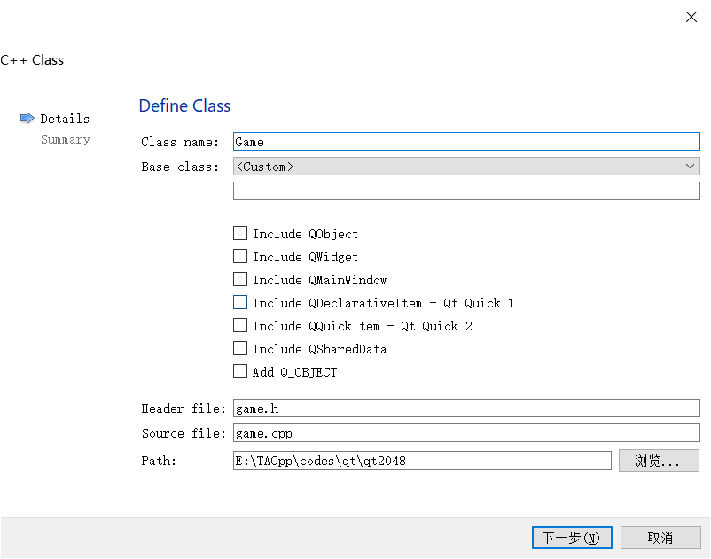

# Qt实践-2048游戏教程(3): Game 模块

Game 模块是游戏的运行逻辑模块。由于这一部分和 Qt界面的代码完全独立，大家可以完全可以自己采用自己喜欢的算法重新实现。

我实现的时候是这样设计的(请不必拘泥于此)

* 我希望有一个4x4的数组用于存放每一轮游戏中小方块的值， `int board[4][4];`

* 游戏初始化的时候需要随机将两个小方块赋值为 2 

* 设计一个 `move` 函数，接收一个表示方向的参数（用于指示上下左右），然后更新 4x4 小方块数组的值。

  * 有一个成员 `changed` ， 用于判断 `move` 前后4x4表盘是否变化。

  * 设计一个 `getEmptyPos` 函数，这样 `move` 结束后，如果表盘发生变化，可以随机获取一个空方块，将其赋值为 2。

  * 有一个成员 `total_score，` 每次 `move` 后都会更新分数。

## 添加 Game 模块
类似前两步骤，我们添加一个 Game 类。配置时啥也不需要勾选。



然后我们复制粘贴如下代码（点开小三角形可以查看代码）。

<details>
  <summary>game.h</summary>
  
```cpp
#ifndef GAME_H
#define GAME_H

#include <array>

const int NCells = 4;

using Pos = std::array<int, 2>;

class Game
{
public:

    int board[NCells][NCells];

    int total_score = 0;
    bool changed;

    Game();

    void move(bool horizonal, bool reverse);

    void resetGame();

    Pos getEmptyPos();

    bool isfull();
    bool wonGame();
};

#endif // GAME_H
```
</details>

<details>
  <summary>game.cpp</summary>

```cpp
#include <algorithm>
#include <cstring>
#include <vector>
#include "game.h"

Game::Game()
{
    resetGame();
}

void Game::resetGame()
{
    memset(board, 0, sizeof board);

    board[rand()%NCells][rand()%NCells] = 2;

    auto pos = getEmptyPos();
    board[pos[0]][pos[1]] = 2;

    total_score = 0; changed = true;
}

Pos Game::getEmptyPos()
{
    int i,j;
    do {
        i = rand() % NCells;
        j = rand() % NCells;
    } while (board[i][j]);
    return {i, j};
}

bool Game::isfull()
{
    return std::all_of(*board, *board + NCells * NCells, [](int x) { return x != 0; } );
}

void Game::move(bool horizonal, bool reverse)
{
    static int board_prev[NCells][NCells];
    memcpy(board_prev, board, sizeof board); //backup

    using Vec = std::vector<int> ;
    auto squeezeVec = [&] (Vec v, bool reverse) -> Vec {
        if (reverse) v = Vec(v.rbegin(), v.rend());
        Vec ans; size_t first = 0;
        while (first+1 < v.size()) {
            if (v[first] == v[first+1]) {
                total_score += v[first] * 2;
                ans.push_back(v[first] * 2), first += 2;
            }
            else ans.push_back(v[first]), first++;
        }
        if (first+1 == v.size()) ans.push_back(v[first]);
        while (ans.size() < NCells) ans.push_back(0);
        return reverse ? Vec(ans.rbegin(), ans.rend()) : ans;
    };

    auto getVal = [&] (size_t i, size_t j) -> int& {
        return horizonal ? board[i][j] : board[j][i];
    };

    for (size_t i=0; i < NCells; ++i) {
        Vec v;
        for (size_t j=0; j < NCells; ++j) {
            if (getVal(i, j)) v.push_back(getVal(i, j));
        }
        auto ans = squeezeVec(v, reverse);
        for (size_t j=0; j < NCells; ++j) {
            getVal(i, j) = ans[j];
        }
    }
    changed = !std::equal(*board, *board + NCells * NCells, *board_prev );
}
```

</details>


以上是 Game 模块-游戏逻辑模块的源代码，由于我用到了很多小技巧和C++11的知识，因此我们不会讲解其中的代码细节。你完全可以根据自己的想法重新写一遍。

## 在 GameBoard 界面模块中引入 游戏逻辑模块 Game

我们在 GameBoard 中增加一个 Game 对象，Game 对象可以提供如下操作

- 每一轮的 **4x4 小方块 的值** `board[4][4]`
- 每一轮的总分 `total_score`
- 一个 `move` 函数，接收一个指示上下左右方向的参数，调用后会更新 4x4 小方块 值
- 检测每一轮后表盘是否变化了 `changed` 
- 返回一个空方块的位置 `getEmptyPos()`

此外我们在 GameBoard 还增加了 `Cell* cells[4][4] {}`; 用于存放 **4x4 小方块的界面的指针**。

我们还增加一个 `keyPressEvent` 函数，用于监听键盘按键事件，然后触发不同的游戏更新方式。


<details>
  <summary>gameboard.h </summary>
  
```cpp
#ifndef GAMEBOARD_H
#define GAMEBOARD_H

#include <QLabel>
#include <QVBoxLayout>
#include <QGridLayout>
#include <QKeyEvent>
#include "game.h"
#include "cell.h"
class GameBoard : public QWidget
{
    Q_OBJECT
public:
    explicit GameBoard(QWidget *parent = 0);

private:
    // main game logic
    Game game;

    Cell* cells[NCells][NCells] {};

    // main layout
    QVBoxLayout *mainLayout;

    // grid layout of board
    QGridLayout *boardLayout;

    // score widget
    QLabel *score;

    void drawBoard();
protected:
    void keyPressEvent(QKeyEvent *event);
};

#endif // GAMEBOARD_H
```

</details>


<details>
  <summary>gameboard.cpp</summary>

```cpp
#include <algorithm>
#include <cstring>
#include <vector>
#include "game.h"

Game::Game()
{
    resetGame();
}

void Game::resetGame()
{
    memset(board, 0, sizeof board);

    board[rand()%NCells][rand()%NCells] = 2;

    auto pos = getEmptyPos();
    board[pos[0]][pos[1]] = 2;

    total_score = 0; changed = true;
}

Pos Game::getEmptyPos()
{
    int i,j;
    do {
        i = rand() % NCells;
        j = rand() % NCells;
    } while (board[i][j]);
    return {i, j};
}


bool Game::isfull()
{
    return std::all_of(*board, *board + NCells * NCells, [](int x) { return x != 0; } );
}


void Game::move(bool horizonal, bool reverse)
{
    static int board_prev[NCells][NCells];
    memcpy(board_prev, board, sizeof board); //backup

    using Vec = std::vector<int> ;
    auto squeezeVec = [&] (Vec v, bool reverse) -> Vec {
        if (reverse) v = Vec(v.rbegin(), v.rend());
        Vec ans; size_t first = 0;
        while (first+1 < v.size()) {
            if (v[first] == v[first+1]) {
                total_score += v[first] * 2;
                ans.push_back(v[first] * 2), first += 2;
            }
            else ans.push_back(v[first]), first++;
        }
        if (first+1 == v.size()) ans.push_back(v[first]);
        while (ans.size() < NCells) ans.push_back(0);
        return reverse ? Vec(ans.rbegin(), ans.rend()) : ans;
    };

    auto getVal = [&] (size_t i, size_t j) -> int& {
        return horizonal ? board[i][j] : board[j][i];
    };

    for (size_t i=0; i < NCells; ++i) {
        Vec v;
        for (size_t j=0; j < NCells; ++j) {
            if (getVal(i, j)) v.push_back(getVal(i, j));
        }
        auto ans = squeezeVec(v, reverse);
        for (size_t j=0; j < NCells; ++j) {
            getVal(i, j) = ans[j];
        }
    }
    changed = !std::equal(*board, *board + NCells * NCells, *board_prev );
}
```
</details>

## 按键事件 KeyPressEvent 

GameBoard 继承自 QWidget，因此可以覆写 `keyPressEvent` 函数, 我们希望根据键盘按键的上下左右触发 不同的 `game.move(bool, bool)` 函数。

```cpp
// gameboard.cpp 
...
void GameBoard::keyPressEvent(QKeyEvent *event)
{
    switch (event->key()) {
    case Qt::Key_Up:
        game.move(false, false);
        break;
    case Qt::Key_Down:
        game.move(false, true);
        break;
    case Qt::Key_Left:
        game.move(true, false);
        break;
    case Qt::Key_Right:
        game.move(true, true);
        break;
    }
...
}
```

## 效果 

最终效果如下


你可以敲击键盘上的上下左右键来控制方块移动。不妨自己试着玩一会吧。

### 不足

我没有设计游戏最终失败后的逻辑，也没有设计游戏成功达到 2048 后的逻辑，你可以自己尝试一下。

---

至此，教程就基本结束了。你已经初步了解了 Qt 设计界面的方式和模块化开发的大体流程。

Qt 在网上的教程还有很多，开源的 demo 项目也是不胜枚举。接下来你可以拉上小伙伴一起玩，共同讨论、尝试设计不一样的 Qt 界面或者游戏。

* [Qt实践-2048游戏教程(1): GameBoard 模块](https://github.com/OneForward/TACpp/blob/master/tutorials/qt-2048-v1.md)
* [Qt实践-2048游戏教程(2): Cell 模块](https://github.com/OneForward/TACpp/blob/master/tutorials/qt-2048-v2.md)
* [Qt实践-2048游戏教程(3): Game 模块](https://github.com/OneForward/TACpp/blob/master/tutorials/qt-2048-v3.md)