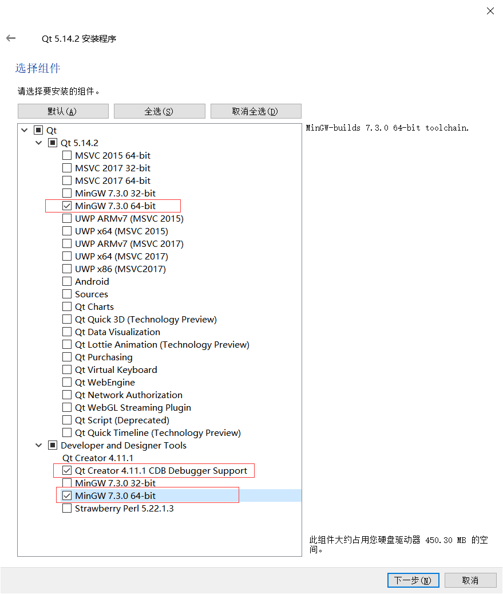
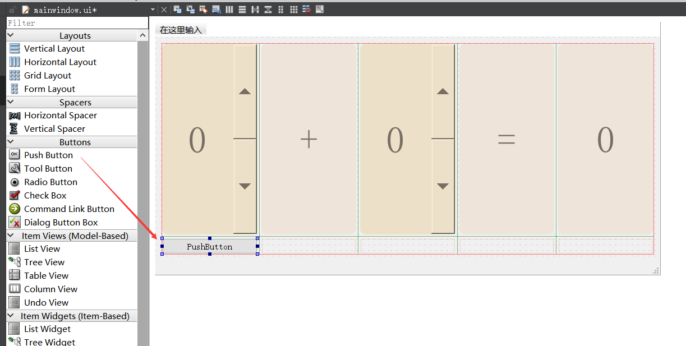
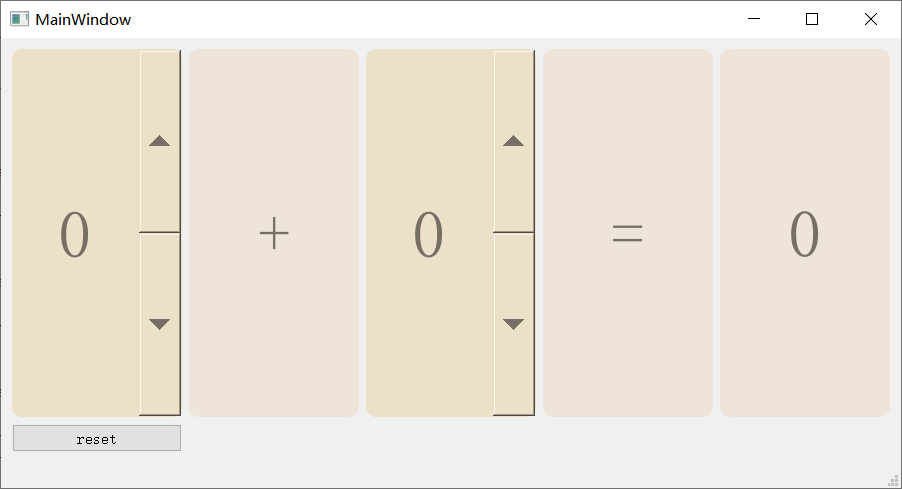

# [Qt的安装与简单使用](https://gitee.com/OneForward/TACpp/blob/master/tutorials/qt-install.md)

- [Qt的安装与简单使用](#qt的安装与简单使用)
  - [Qt 下载链接](#qt-下载链接)
  - [Qt 安装步骤](#qt-安装步骤)
  - [书写第一个 Qt 可视化界面 - 简易计算器](#书写第一个-qt-可视化界面---简易计算器)
    - [新建Qt项目](#新建qt项目)
    - [绘制第一个可视化界面](#绘制第一个可视化界面)
    - [实现计算逻辑](#实现计算逻辑)
    - [添加一个清零的按键](#添加一个清零的按键)
    - [添加一个显示文本的按键](#添加一个显示文本的按键)

Qt 是一个免费、开源的可视化界面工具包，用于创建图形用户界面以及运行在各种软件和硬件平台（例如Linux，Windows，macOS，Android或嵌入式系统）上的跨平台应用程序。

Qt 目前是由公开上市公司 Qt Company 和 Qt 项目组在开源代码治理下开发的，由个人开发者和组织共同参与。Qt 可在商业许可和开源 GPL 2.0，GPL 3.0和 LGPL 3.0 许可下使用。【摘自维基 [Qt (software)](https://en.wikipedia.org/wiki/Qt_(software)) 】

Qt 必须要注册账号后才能安装。请访问链接 [注册账号](https://login.qt.io/register) 。

从2020年开始 Qt 的长期支持版本(long term support, LTS) 和离线安装包只有商业许可才能使用，影响 Qt 5.15 以及之后的版本，旧版本的 Qt 则不受影响。因此目前公开渠道只能下载到 Qt 5.14。当然由于 Qt 是开源代码的，你也可以自己下载源码编译。 [qt-offering-changes-2020](https://www.qt.io/blog/qt-offering-changes-2020)

## Qt 下载链接 

Qt 安装包下载链接请点击 [交大镜像](https://mirrors.sjtug.sjtu.edu.cn/qt/official_releases/qt/5.14/5.14.2/) ，里面包含 windows、linux 和 mac 下的安装包。

## Qt 安装步骤

<details>
  <summary> 安装 Qt 的具体步骤【点开小三角形查看】 </summary>

* 下载后双击安装。点击 `next`


* 提示需要登录 qt 账号，请注册一个 qt 账号，之后登录即可 


* 接受开源条例, GPL v2、GPL v3 和 LGPL v3。


* 点击下一步


* 选择安装路径


* 最重要的一步，勾选**相对应的编译器**。



* 之后一路确认即可。
</details>


安装好后，你会可以打开 Qt 自带的 IDE， Qt Creator， 来尝试书写你的第一个 Qt 可视化界面。

## 书写第一个 Qt 可视化界面 - 简易计算器

本项目源代码由 gitee 托管。 点击 [链接](https://gitee.com/OneForward/TACpp/archive/master.zip) 下载。下载后，在 labs 文件夹下，使用 Qt 打开相应的 .pro 工程文件即可运行了。或者，参照如下流程，一步一步地添加代码。

### 新建Qt项目

<details>
  <summary>  在 Qt Creator 新建Qt项目【点开小三角形查看】 </summary>
打开 Qt Creator. 

按住 `Crtl Shift N` 新建工程项目。

* 点击确定。


* 设置工程名。


* 一路点击默认选项。

最终我们会得到如图所示的一个项目


按住 `Ctrl R` 运行可以得到一个没有任何组件的界面程序。


点击 mainwindow.ui， 你会看到 Qt Creator 提供的 UI 设计界面。你可以通过拖动 左侧的控件、设置控件的参数来设计界面。


</details>

### 绘制第一个可视化界面

<details>
  <summary> 绘制第一个可视化界面【点开小三角形查看】 </summary>

从左侧拖动一个 GridLayout 控件，我们将在这上面存放所有的组件。


- 从左侧拖动一个 Label 控件，用于显示文本


 
- 右键单击这个文本控件，选择改变样式表


- 设定其样式表如下

```yaml
background: rgb(238,228,218); 
color: rgb(119,110,101); 
border-radius: 10px; 
font: bold; 
font: 40pt; 
```


- 然后修改这个文本控件的 sizePolicy 和 对齐方式 
  
  sizePolicy 都选择 miniMum， 对齐方式都选择居中对齐

  顺便把文本修改为 `0`


- 然后我们拷贝这个控件三次，选中这个文本控件 Ctrl C, Ctrl V 三次

  顺便把文本修改为 `+`、 `=`、 `0`


- 从左侧拖动一个 SpinBox 控件，用于输入数字


- 右键单击这个文本控件，选择改变样式表 
  
  


- 设定其样式表如下

```yaml
background: rgb(237,224,200); 
color: rgb(119,110,101); 
border-radius: 10px; 
font: bold; 
font: 40pt; 
```


- 同样修改这个输入控件的 sizePolicy 和 对齐方式 


- 拷贝刚刚的输入框 ，现在有 2 个输入框了


- 拖入 GridLayout 中


- 右键单击背景，设置主窗口的布局方式为 栅格布局


- 设置主窗口的尺寸 900 x 450


</details>

按住 `Ctrl R` 可以得到第一次运行的结果

此时还没有实现计算逻辑。


### 实现计算逻辑

<details>
  <summary> 实现计算逻辑【点开小三角形查看】 </summary>

我们给两个输入框和输出框分别取名为 `x1` , `x2` 和 `y`


右键第一个输入框，选择 `转到槽`


然后选择 `valueChanged(int)`


IDE会把界面跳转到 mainwindow.cpp 中去，并且增加了一个函数，我们完善这个函数，改成 

```cpp
void MainWindow::on_x1_valueChanged(int val)
{
    ui->y->setText(QString::number(ui->x2->value() + val));
}
```


点击 mainwindow.ui 回到刚刚的设计界面。对第2个输入框重复上述操作，同样会跳出一个函数，改为

```cpp
void MainWindow::on_x2_valueChanged(int val)
{
    ui->y->setText(QString::number(ui->x1->value() + val));
}
```


</details>

按住 `Ctrl R` 可以得到第2次运行的结果。现在，计算逻辑就实现好了。


### 添加一个清零的按键
<details>
  <summary> 添加一个清零的按键【点开小三角形查看】 </summary>

从左侧拖动一个 PushButton 控件，这是一个按钮，点击可以触发某些逻辑。



将文本改为 reset, 在右侧将 PushButton 控件的变量名字也改为 reset


类似上面的步骤，右键按钮控件，选择 `转到槽`，


选择 `Clicked()`


在跳出的函数中，添加如下代码

```cpp
void MainWindow::on_reset_clicked()
{
    ui->x1->setValue(0);
    ui->x2->setValue(0);
}
```


</details>

按住 `Ctrl R` 可以得到第3次运行的结果。此时点击 reset 按键会跳出 输入框会清零。



### 添加一个显示文本的按键


<details>
  <summary> 添加一个显示文本的按键【点开小三角形查看】 </summary>

仿照上述步骤即可。


</details>

按住 `Ctrl R` 可以得到第4次运行的结果。此时点击 about 按键会跳出 `Hello Qt!` 的信息框。


